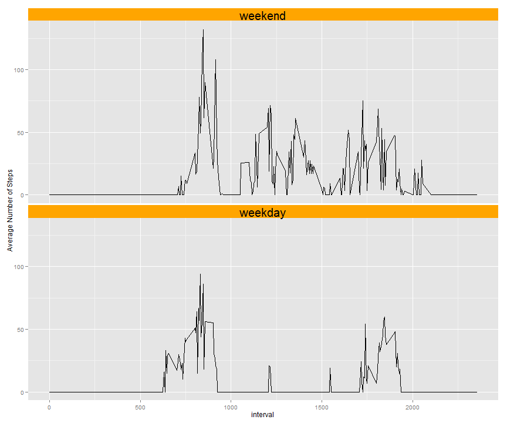

# Reproducible Research: Peer Assessment 1 

*submitted: 14 June 2014*


## Data 
The assignment makes use of data collected from a personal activity monitoring device which 
collects data at 5-minute intervals throughout the day and records the number of steps 
taken in each interval. The data provided is from an anonymous individual and covers a two(2)
month period from October 2012 to November 2012.

## Loading and preprocessing the data

The zip file containing the data required for the assignment can be dowloaded from the provided 
Url : https://d396qusza40orc.cloudfront.net/repdata%2Fdata%2Factivity.zip  using the following 
R code:


```r
zipfile <- "activity.zip"
## Download and unzip file from provided URL
if (!file.exists(zipfile)) {
    fileurl <- "https://d396qusza40orc.cloudfront.net/repdata%2Fdata%2Factivity.zip"
    download.file(fileurl, destfile = zipfile, method = "internal")
}
# stop if downloading failed or activity.csv file not in working directory
if (!file.exists(zipfile)) {
    stop("Error: activity.zip is not in the working directory.")
}
```


Before loading the required dataset, the **activity.zip**  file needs to be unzipped to extract
the **activity.csv** file which can then be opened using the read.csv command. The following R 
code performs these steps and then displays the first five (5) observations in the dataset.

```r
## unzip the source file to extract 'activity.csv' datafile and load the data
## set
unzip(zipfile)
datafile <- "activity.csv"
projData <- read.csv(datafile, colClasses = c("numeric", "Date", "numeric"))
head(projData, 5)  ## display first 5 rows of the dataset
```

```
##   steps       date interval
## 1    NA 2012-10-01        0
## 2    NA 2012-10-01        5
## 3    NA 2012-10-01       10
## 4    NA 2012-10-01       15
## 5    NA 2012-10-01       20
```


The preprocessing required includes changing the *interval* variable to a factor variable and
converting the date variable to a date variable using the following R code.

```r
## change integer interval variable to 4 digit factor, and date variable to a
## Date() variable
projData$intervalFactor <- factor(sprintf("%04d", projData$interval))
projData$date <- as.Date(projData$date, "%Y-%m-%d")
```


## What is mean total number of steps taken per day?

The following histogram displays the total number of steps taken each day

```r
## calculate total number of steps per day
library(plyr)
dailyTotalData <- projData[complete.cases(projData$steps), ]  # remove NA values
dailyTotals <- tapply(dailyTotalData$steps, dailyTotalData$date, mean, na.rm = TRUE)

hist(dailyTotals, col = "blue", main = "Histogram of Total Number of Steps", 
    xlab = "Total Number of Steps")
```

 


     
The following R code computes the mean and median total number of steps taken each day; The 
calculated values have been formatted for neatness in the output.

```r
## Calaculate mean and median total number of steps
meanTotalNumberofSteps <- sprintf("%.4f", mean(dailyTotals, na.rm = TRUE))
medianTotalNumberofSteps <- sprintf("%.4f", median(dailyTotals, na.rm = TRUE))
print(c(meanTotalNumberofSteps, medianTotalNumberofSteps))
```

```
## [1] "37.3826" "37.3785"
```


The mean number of steps per day taken by the individual in a 5-minute interval is 37.3826 is and the median is 37.3785

## What is the average daily activity pattern?

The following R code plots and displays the averagae daily activity pattern

```r
library(ggplot2)
library(plyr)
## create data frame for intervals and averages for each interval
avgpatternData <- ddply(projData, "intervalFactor", transform, average = mean(steps, 
    na.rm = TRUE))

## plot interval against average number of steps taken in each interval
plot(avgpatternData$interval, avgpatternData$average, type = "l", ylab = "Averge steps per day ", 
    xlab = "Interval", main = "Average Daily Activity Pattern")
```

 


The following R code finds and displays the 5-minute interval with the maximum number of steps.

```r
## get interval with maximum number of steps, on average
maxIntervalArray <- avgpatternData[(avgpatternData$average >= max(avgpatternData$average)), 
    ]
maxInterval <- maxIntervalArray[1, ]$interval
print(maxInterval)
```

```
## [1] 835
```


On average, the 835   time interval has the maximum number of steps taken by the anonymous individual.

## Imputing missing values

The presence of missing rows may introduce bias into some computations.The following code calculates and displays the number of observations (rows) with at least one missing value.

```r
numberofIncompleteRow <- nrow(projData) - sum(complete.cases(projData))
print(numberofIncompleteRow)
```

```
## [1] 2304
```


The number of incomplete observations (rows) is 2304

In this assignment the missing rows in the steps variable (column) are a potential source of bias. 
The strategy for dealing with these missing vlaues was to replace a missing value (NA) in the steps column with the average number of steps for the time interval where that NA appears. The following codes performs this transformation, and displays the first first rows in the data set.


```r
## Transform dataframe by replacing NAs in number of steps by average number
## of steps in the corresponding time interval
library(plyr)
filledProjData <- ddply(projData, .(intervalFactor), transform, intervalMean = mean(steps, 
    na.rm = TRUE))

filledProjData$steps <- with(filledProjData, ifelse(is.na(steps), intervalMean, 
    steps))

## display first 5 rows
head(filledProjData, 5)
```

```
##    steps       date interval intervalFactor intervalMean
## 1  1.717 2012-10-01        0           0000        1.717
## 2  0.000 2012-10-02        0           0000        1.717
## 3  0.000 2012-10-03        0           0000        1.717
## 4 47.000 2012-10-04        0           0000        1.717
## 5  0.000 2012-10-05        0           0000        1.717
```


All NAs in the steps variable have been replaced accordingly. The following histograms displays the total number of steps taken in each 5-minute interval per day.

```r

revdailyTotals <- tapply(filledProjData$steps, filledProjData$date, mean, na.rm = TRUE)


hist(revdailyTotals, col = "red", main = "Histogram of Total Number of Steps", 
    xlab = "Total Number of Steps per day")
```

 


After the transformation, the mean and median total number of steps taken each day was computed. The calculated values have been formatted for neatness of the output.

```r
revmeanTotalNumberofSteps <- sprintf("%.4f", mean(revdailyTotals, na.rm = TRUE))
revmedianTotalNumberofSteps <- sprintf("%.4f", median(revdailyTotals, na.rm = TRUE))
print(c(revmeanTotalNumberofSteps, revmedianTotalNumberofSteps))
```

```
## [1] "37.3826" "37.3826"
```


The revised average number of steps per interval is 37.3826 is and the median is 37.3826. The chosen strategy has not changed the mean and the median has increased.

## Are there differences in activity patterns between weekdays and weekends?

The following R code generates a plot that compares the average number of steps per interval over
normal weekdays, and the average over weekends.


```r

dayTypepatternData <- filledProjData
## add day of the week variable, and day type variable
dayTypepatternData$day <- weekdays(filledProjData$date)
weekday <- c("Monday", "Tuesday", "Wednesday", "Thursday", "Friday")
weekend <- c("Saturday", "Sunday")
dayTypepatternData$daytype <- factor(ifelse(dayTypepatternData$day %in% weekend, 
    "weekend", "weekday"))

## re-order levels in daytype factor to match sample plot
dayTypepatternData$daytype = with(dayTypepatternData, factor(daytype, levels = rev(levels(daytype))))


## claculate interval averages grouped by day type
dayTypepatternData <- ddply(dayTypepatternData, .(intervalFactor, daytype), 
    transform, average = median(steps, na.rm = TRUE))
library(ggplot2)
require(grid)
```

```
## Loading required package: grid
```

```r
g <- qplot(interval, average, data = dayTypepatternData, geom = "line", ylab = "Average Number of Steps") + 
    facet_wrap(~daytype, ncol = 1)

g <- g + theme(strip.background = element_rect(fill = "orange")) + theme(strip.text.x = element_text(size = 20))
print(g)
```

 


The plot shows a pick at the 835 interval on both weekdays and weekends. However, there appears to be less movement/activity during working hours on weekdays, and more activity on weekends.
