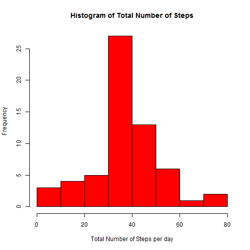

# Reproducible Research: Peer Assessment 1

## Introduction 
The assignment makes use of data collected from a personnal activity monitoring device which collects data at 5-minute interval throughout the day and records the number of steps taken in each interval. The data provided is from an anonymous individual and covers a 2 month period from October 2012 to November 2012.

## Loading and preprocessing the data

The zip file containing the data required for the assignment can be dowloaded from the provided Url : https://d396qusza40orc.cloudfront.net/repdata%2Fdata%2Factivity.zip  using the following code:


```r
zipfile <- "activity.zip"
## Download and unzip file from provided URL
if (!file.exists(zipfile)) {
    fileurl <- "https://d396qusza40orc.cloudfront.net/repdata%2Fdata%2Factivity.zip"
    download.file(fileurl, destfile = zipfile, method = "internal")
}
# stop if downloading failed or activity.csv file not in working directory
if (!file.exists(zipfile)) {
    stop("Error: activity.zip is not in the working directory.")
}
```


Before loading the required dataset, the **activity.zip**  file needs to be unzipped to extract the **activity.csv** file which can then be opened using the read.csv command. The following code performs these steps and then displays the first five (5) observations in the dataset.

```r
unzip(zipfile)  ## unzip the source file to extract 'activity.csv' datafile
datafile <- "activity.csv"
projData <- read.csv(datafile, colClasses = c("numeric", "Date", "numeric"))  ## load the project data
head(projData, 5)  ## display first 5 rows of the dataset
```

```
##   steps       date interval
## 1    NA 2012-10-01        0
## 2    NA 2012-10-01        5
## 3    NA 2012-10-01       10
## 4    NA 2012-10-01       15
## 5    NA 2012-10-01       20
```


The preprocessing requires include changing the *interval* variable to a factor variable and converting the date variable to a date variable using the following code.

```r
## change integer interval variable to 4 digit factor, and date variable to a
## Date() variable
projData$intervalFactor <- factor(sprintf("%04d", projData$interval))
projData$date <- as.Date(projData$date, "%Y-%m-%d")
```


## What is mean total number of steps taken per day?

The following histogram displays the total number of steps taken each day

```r
hist(projData$steps, col = "blue", main = "Total Number of Steps", xlab = "Total Number of Steps per day")
```

 


     
The following code computes the mean and median total number of steps taken each day;The calculated 
values have been formatted for neatness in the output.

```r
meanTotalNumberofSteps <- sprintf("%.4f", mean(projData$steps, na.rm = TRUE))
medianTotalNumberofSteps <- sprintf("%d", median(projData$steps, na.rm = TRUE))
print(c(meanTotalNumberofSteps, medianTotalNumberofSteps))
```

```
## [1] "37.3826" "0"
```


The mean 37.3826 is and the median is 0

## What is the average daily activity pattern?

The following coded plots and displays the averagae daily activity pattern

```r
library(ggplot2)
```

```
## Warning: package 'ggplot2' was built under R version 3.0.3
```

```r
## create data frame for intervals and averages for each interval
library(plyr)
```

```
## Warning: package 'plyr' was built under R version 3.0.3
```

```r
avgpatternData <- ddply(projData, "intervalFactor", transform, average = mean(steps, 
    na.rm = TRUE))

## plot intervals against averages
plot(avgpatternData$interval, avgpatternData$average, type = "l", ylab = "Averge steps per day ", 
    xlab = "Interval", main = "Average Daily Activity Pattern")
```

 


The following finds and displays the 5-minute interval with the maximum number of steps.

```r
## get interval with maximum number of steps, on average
maxIntervalArray <- avgpatternData[(avgpatternData$average >= max(avgpatternData$average)), 
    ]
maxInterval <- maxIntervalArray[1, ]$interval
print(maxInterval)
```

```
## [1] 835
```


On average, the 835   time interval has the maximum number of steps taken by the anonymous individual.

## Imputing missing values

The following code calculates and displays the number of observations (rows) with at 
least one missing value.

```r
numberofIncompleteRow <- nrow(projData) - sum(complete.cases(projData))
print(numberofIncompleteRow)
```

```
## [1] 2304
```


The number of incomplete observations (rows) is 2304

The presence of missing rows may introduce bias into some computations. In this assignment the missing rows in the steps variable (column)  are a potential source of bias. The strategy for dealing with missing vlaues was to replace a missing value (NA) in the steps column with the average median value for the time interval where that NA appears. The following codes performs this transformation, and displays the first first rows in the data set.


```r
## Transform dataframe by replacing NAs in number of steps by average number
## of steps in the corresponding time interval
library(plyr)
```

```
## Warning: package 'plyr' was built under R version 3.0.3
```

```r
filledProjData <- ddply(projData, .(intervalFactor), transform, intervalMedian = median(steps, 
    na.rm = TRUE))
filledProjData$steps <- with(filledProjData, ifelse(is.na(steps), intervalMedian, 
    steps))

## display first 5 rows
head(filledProjData, 5)
```

```
##   steps       date interval intervalFactor intervalMedian
## 1     0 2012-10-01        0           0000              0
## 2     0 2012-10-02        0           0000              0
## 3     0 2012-10-03        0           0000              0
## 4    47 2012-10-04        0           0000              0
## 5     0 2012-10-05        0           0000              0
```


All NAs in the steps variable have been replaced accordingly. The following histograms displays the total number of steps taken in each 5-minute interval per day.

```r
hist(filledProjData$steps, col = "blue", main = "Total Number of Steps", xlab = "Total Number of Steps per day")
```

 


After the transformation, the mean and median total number of steps taken each day was computed. The calculated values have been formatted for neatness of the output.

```r
rmeanTotalNumberofSteps <- sprintf("%.4f", mean(filledProjData$steps, na.rm = TRUE))
rmedianTotalNumberofSteps <- sprintf("%d", median(filledProjData$steps, na.rm = TRUE))
print(c(rmeanTotalNumberofSteps, rmedianTotalNumberofSteps))
```

```
## [1] "32.9995" "0"
```


The revised mean 32.9995 is and the median is 0. We observe that after replacing the NAs in the steps variable, the mean has decreased from 37.3826 to 32.9995

## Are there differences in activity patterns between weekdays and weekends?

The following code generate a plot that compares the average number of steps per interval over normal wekdays, and the average over weekends.


```r

dayTypepatternData <- filledProjData
## add day of the week variable, and day type variable
dayTypepatternData$day <- weekdays(filledProjData$date)
weekday <- c("Monday", "Tuesday", "Wednesday", "Thursday", "Friday")
weekend <- c("Saturday", "Sunday")
dayTypepatternData$daytype <- factor(ifelse(dayTypepatternData$day %in% weekend, 
    "weekend", "weekday"))

## re-order levels in daytype factor to match sample plot
dayTypepatternData$daytype = with(dayTypepatternData, factor(daytype, levels = rev(levels(daytype))))


## claculate interval averages grouped by day type
dayTypepatternData <- ddply(dayTypepatternData, .(intervalFactor, daytype), 
    transform, average = median(steps, na.rm = TRUE))
library(ggplot2)
```

```
## Warning: package 'ggplot2' was built under R version 3.0.3
```

```r
require(wrap)
```

```
## Loading required package: wrap
```

```
## Warning: there is no package called 'wrap'
```

```r
require(grid)
```

```
## Loading required package: grid
```

```r
g <- qplot(interval, average, data = dayTypepatternData, geom = "line", ylab = "Average Number of Steps") + 
    facet_wrap(~daytype, ncol = 1)

g <- g + theme(strip.background = element_rect(fill = "orange")) + theme(strip.text.x = element_text(size = 20))
print(g)
```

 


